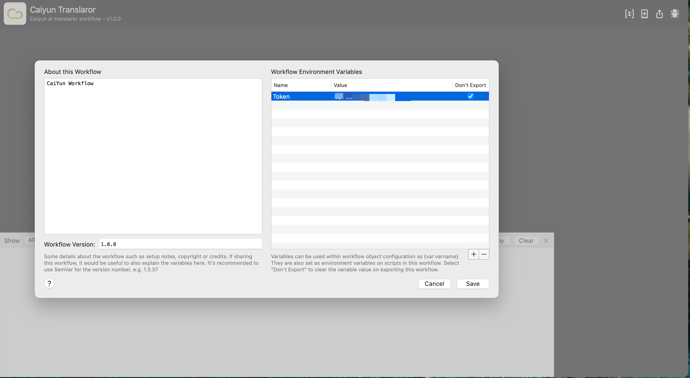
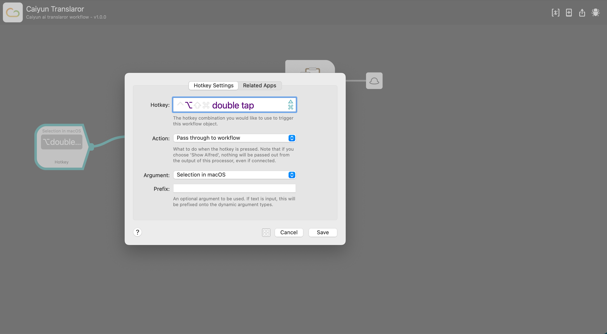

## Caiyun Translate 彩云翻译

### 介绍

* 自带[txiki.js](https://github.com/saghul/txiki.js)运行环境，无需依赖Node.js
* 单词自动识别，支持中英互译
* 支持translator和dictionary两种模式
* 双击快捷键翻译选中文本，回车`↩︎ Enter`复制

### 安装

* [Github Release](https://github.com/yzzting/workflow-caiyun/releases/tag/v1.0.0)

### 配置

* 获取彩云小译[Key](https://platform.caiyunapp.com/login)
* 配置WorkFlow环境变量`TOKEN`，值为彩云小译Key

* 配置快捷键

### 参考资料

* [YoudaoTranslator](https://github.com/wensonsmith/YoudaoTranslator)
* [AlfredWorkflow](https://github.com/joetannenbaum/alfred-workflow)
